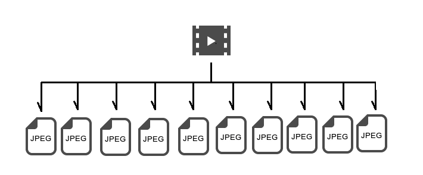

# Movie2jpg

タイムラプス動画ファイルからMapillary用の静止画を生成する


## 概要

** 動画ファイルから一定間隔の静止画(JPEG)ファイルを生成する **



撮影された動画ファイルから１秒間隔の静止画を取り出します。

 * ソースとなる動画ファイルはタイムラプス撮影されたものに限定されるわけではありませんが、他の撮影方法で撮影された動画の動作確認は行っていませんので動くかどうかはわかりません。


## Repository

- github
 - `https://github.com/yuuhayashi/Movie2jpg.git`

- maven repository (Archiva) 
 - `http://surveyor.mydns.jp/archiva/#artifact~haya4/osm.surveyor.movie2jpg/Movie2jpg`
 - `http://surveyor.mydns.jp/archiva/repository/haya4/osm/surveyor/movie2jpg/Movie2jpg/2.0.0/Movie2jpg-2.0.0-jar-with-dependencies.jar`

- DockerHub
 - 
 
## Install / インストール

** Dockerのインストールとビルド **

  **Docker 'haya4/movie2jpg'**

初回に限りDockerのインストールとビルドが必要です。

こちら → [DockerBuild](wiki/DOCKERBUILD.md) を参考にしてインストールとビルドを行ってください。


## Quick start / 実行

### 動画ファイルのセット

撮影した動画ファイルを任意の場所に配置します。

```
      ~/
　　　┗━ ~/Movie
　　　　　　┣━ XXXX.mp4
　　　　　　┗━ YYYY.mov
```

例: フォルダ `~/Movie` に**動画(MP4/MOV)**ファイルを配置します。

 - `*.mp4`または`*.mov`形式の動画ファイルに対応しています

 - 複数の動画ファイルをセットできます。


### 静止画の切り出し処理を実行 - Docker run

- (1) 動画ファイルをセットしたフォルダに移動

  ```
  cd ~/Movie
  ```

- (2) 下記コマンドを実行

  ```
  docker run -it -v $(pwd):/mnt/mapi:rw movie2jpg java -cp .:/root/Movie2jpg.jar osm.surveyor.movie2jpg.Movie2jpg
  ```

実行すると、「Movie2jpg」が起動され、`~/Movie`フォルダ内の「動画(MP4,mov)」ファイルごとに

  ```
  ffmpeg -ss 0 -i ./(movie-file) -r (fps) ./img/(movie-file)/%05d.jpg
  ```

がDockerコンテナ内部で実行されます。

完了すると、`~/Movie/img`フォルダの下にMP4ファイル名と同じ名前のフォルダが作成され、その中に切り出されたJPEG画像が生成されます。

```
~/
┗━ ~/Movie
　　　┣━ XXXX.mov
　　　┣━ YYYY.mp4
　　　┃
　　　┗━ ~/Movie/img
　　　　　　┣━ XXXX
　　　　　　┃　　┣━ 00001.jpg
　　　　　　┃　　┣━ 00002.jpg
　　　　　　┃　　┣━     :
　　　　　　┃　　┗━ 01861.jpg
　　　　　　┗━ YYYY
　　　　　　　　　┣━ 00001.jpg
　　　　　　　　　┣━ 00002.jpg
　　　　　　　　　┣━     :
　　　　　　　　　┗━ 02408.jpg
```


## Depends / 動作依存

- docker 'haya4/Movie2jpeg'
 - based by "ubuntu:18.04"
 - java 1.8
 - ffmpeg
 