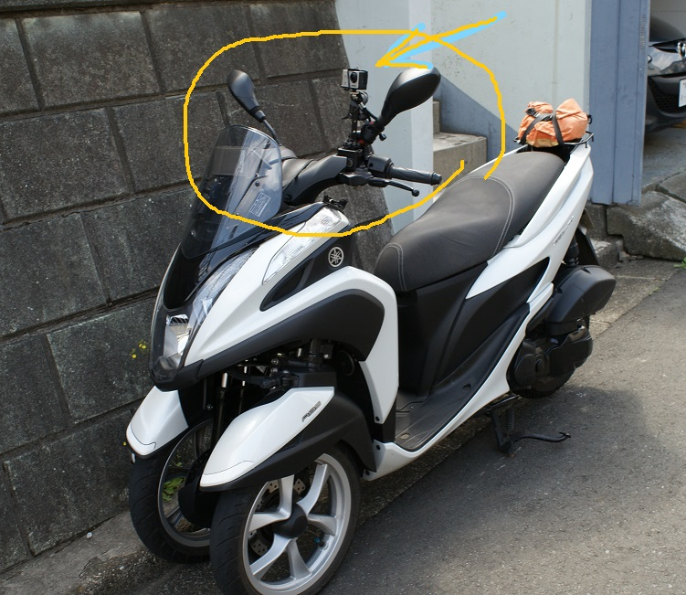
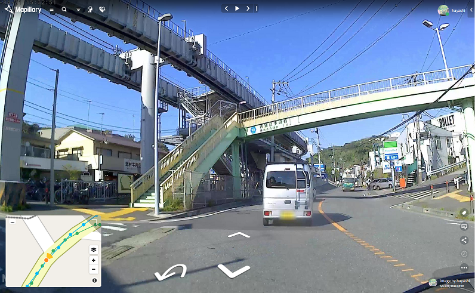
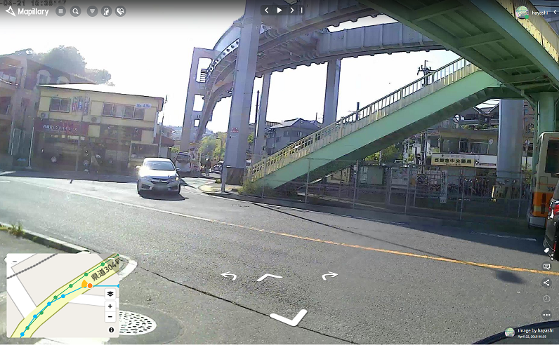

[タイムラプス動画ファイルから静止画を生成する](README.md)
----

# 中華アクションカムについて

「中華アクションカム」とは GoPro と類似する製品のこと、4000円弱(2018-05現在)で家電量販店などの特売で販売されている。
製品自体の種類が多く、１つの型番は２～３か月ほどで姿を消すが、型番は違うが中身はほぼ一緒のようです。
ここでは私が購入した「WiMiUS」という製品で説明します。


### 中華アクションカムの問題点

 * 「手振れ」機能がない

 * タイムラプス撮影を行うと0.5秒ピッチから設定できるが、生成されるのはH265形式の動画ファイルのみとなる。

 * インターバル撮影モードにするとJPEGファイルが一定間隔で生成されるが、設定できる時間が「最小３秒」と間隔が長すぎる。

 * インターバル撮影モードは撮影時のビープ音がうるさい。

 * バッテリーを外すと「日時」の設定がリセットされてしまう。

これらの問題点のなかでMapillary撮影としてはタイムラプスで静止画ファイルが生成されないのが致命的。  
次に、バッテリー交換のたびに日時設定をやり直さなければならないのがめんどくさい。  
「手振れ」機能については意外にもそれほど気にならない。


## タイムラプスモード設定

Mapillaryにアップするなら１秒間隔にしたいので **タイムラプス撮影** に挑戦する必要がある。

 * 間隔は１秒  
    GPSロガーのロギング間隔を１秒間に設定するのでそれに合わせてタイムラプスも１秒間隔で十分。  
    最小0.5秒に設定することができるが、切り出したJPEGに撮影時刻を割り当てる際に１秒単位でしか設定することができないため、1秒間隔で十分。  

 * 出力形式はMP4(h265)になってしまう  
    出力されるのはカメラの仕様上MP4(h265)になります。

 * リアルタイム動画は？  
    タイムラプスではなくそのまま動画で撮影した場合は？ もちろんタイムラプスに比べて動画のファイルサイズは大きくなります。  
    しかし、SDカードの容量がいっぱいになる前にバッテリーのほうが先になくなるのでファイルサイズはあまり問題になりません。  
    リアルタイム動画ではコマ落ちの可能性が高くなるような気がします（個人の感想です）。  
    JPEGに撮影時刻を割り当てる際に時間のズレが生じる可能性が高くなります。


## カメラ設定

`カメラの設定項目と推奨設定値`
  ```
設定モード
┃
┣━ ビデオ設定
┃　　┃
┃　　┣━ ビデオ解像度　[4K30FPS] <-- 任意
┃　　┣━ 録画音声 [OFF]
┃　　┣━ タイムラプス [OFF | 0.5s | 1s | 2s | 5s | 10s | 30s | 60s] <-- 1s
┃　　┣━ ループ録画 [OFF | 2分 | 3分 | 5分] <-- オフ
┃　　┗━ スローモーション [*]
┃
┣━ カメラ設定
┃　　┃
┃　　┣━ ピクセル　[2M | 5M | 8M | 12M | 16M ] <-- 任意（16M）
┃　　┣━ セルフタイマー　[*] <-- 任意
┃　　┣━ オート撮影　[OFF | 3S | 10S | 15S | 20S | 30S] <-- 任意
┃　　┗━ ドラマ？ショット [*]
┃
┣━ 撮影設定
┃　　┃
┃　　┣━ 露出　[-3 | -2 | -1 | 0 | 1 | 2 | 3] <-- 0
┃　　┣━ ホワイトバランス　[オート | 晴れ | 曇り | 白熱電球 | 蛍光灯] <-- オート
┃　　┣━ WiFi　[ON | OFF] <-- OFF
┃　　┣━ ローテーション　[ON | OFF] <-- OFF
┃　　┣━ 車載モード　[ON | OFF] <-- OFF　（ONにすると、電源をONにしただけで勝手に録画が始まってしまう）
┃　　┣━ 光周波数　[*] <-- オート
┃　　┣━ LEDインジケータランプ　[*] <-- 任意
┃　　┣━ 自動スクリーンセーバ　[*] <-- 任意 (30s)
┃　　┣━ 自動電源オフ　[*] <-- 任意 (オフ)
┃　　┗━ 時間ウォーターマーク　[ON | OFF] <-- **(ON)**
┃
┗━ その他の設定
　　　┃
　　　┣━ 言語　[*] <-- 日本語
　　　┣━ 日付・時間
　　　┣━ フォーマット
　　　┣━ 工場出荷状態に戻し
　　　┗━ ファームウェアバージョン
  ```

Mapillary用のタイムラプス動画の設定

 * 録画音声 [OFF]
 * タイムラプス  <-- 1s
 * ループ録画  <-- オフ
 * ローテーション　<-- OFF
 * 車載モード <-- OFF
 * 自動電源オフ　<-- オフ
 * 時間ウォーターマーク　<-- **(ON)**

タイムラプスの設定は当然として、「時間ウォーターマーク」は必ずONにすること、動画から切り出した静止画に日時を設定する際に威力を発揮します。


### カメラの時刻合わせ

多くの中華カメラはバッテリーを外すとカメラに設定された「日時」が工場出荷状態にリセットされます。  
バッテリーを交換したら忘れずに「日時」を再設定すること！

時刻合わせの方法は手動で設定するよりも、スマホアプリを使った方が簡単かつ正確な時刻を設定できます。  
あらかじめ中華カメラ用のアプリをスマホにインストールしておきましょう。

`設定方法`  
  ```
  (1) カメラの電源を入れる
  
  (2) カメラのメニューから
    設定モード
    ┃
    ┗━ その他の設定
　　　    ┃
　　　    ┗━ WiFi ← ONにする

  (3) スマホのWiFiをONにして、カメラのWiFiに接続する
  
  (4) スマホのアプリを起動して「接続」する
    カメラとの接続が確認出来たらアプリを終了する
    
  (5) カメラのWiFiを閉じる
  
  (6) カメラの電源をOFFにする
  
  (7) カメラの電源をONにする
    これで日時が設定されました。
  ```
  
  時間合わせの操作は何回か練習して体に叩き込んでおくこと！
  
  
## カメラの取り付け



ここでは中華カムにとって最も過酷な環境での取り付け例を示します。  
この写真のように取り付けるとバイクのエンジンの振動でアイドリング状態でもかなりカメラが揺れます。  
「手振れ」機能がない中華カムにとっては'あり得ない'状態になりますが、敢えてこれでやってみます。（結果的にはこれでもいける）

よりよい画像を望むなら、胸につけるとか首からぶら下げるなどの方法をお勧めします。人体が緩衝材になって振動が抑えられます。  
ヘルメットに着けるのはお勧めしません。（視線に合わせてカメラがパンしちゃうため）

  

Mapillary撮影の３点セット

 * 広角カメラ  
4000円の中華カメラでもいけるのか？

 * GPSロガー  
GPSロガーは撮影中は操作しないのでポケットにでも入れておけばよい。電池の持ちがいい機種がおすすめ。  
なければスマホアプリのロガーでも可。ただし、スマホをロガーにするときはスマホのバッテリー切れに注意！

 * 時間合わせ用のスマホ  
中華カメラを使うときは時間合わせ用のスマホが必須。

### 撮影の注意点

* **GPSロガーは常時オン**にする  
カメラより先にロガーを起動して、カメラを停止してからロガーを停止する。  
そのため、バッテリーで長時間稼働できるロガーがよい。

* 撮影は**超長撮り**  
後で動画から静止画を切り出してファイル更新日時を再設定するのだが、その際に途中で撮影されていないコマがあると正しい時刻を設定できなくなる。  
信号待ちでもそのまま撮影を継続すること  
休憩などで撮影を停止するときは、停止ボタンを押した後にカメラの電源をOFFにする。  
操作を誤って停止ボタンを押したときもカメラの電源をいったんOFFにすること。  
カメラ電源をOFFにすることで、撮影中の動画がCLOSEされて、次回は新たなファイルが作られます。  
撮影停止を押すと、再開しても新しいファイルが作られずに現在のファイルに追加されます。  
すると、撮影されていない時間帯ができ、正確な更新日時を設定できなくなります。

* **晴天の正午前後**  
きれいな動画撮影には光が必要！  
道路がすいている早朝よりも、太陽が天頂に近い時間帯がおすすめ  
早朝や夕刻は逆光になることがあるため

* **ゆっくり**走ろう  
安全のためではない。時速30km/hなら１秒間に10m進む。60km/hなら20m間隔になる。  
速度が上がれば上がるほど早いシャッター速度が必要になるが光量は限られているのでシャッター速度に限界がある。  
シャッター速度の限界を超えると**ボケ**る。  
「手振れ」機能がない中華カメラなら推して知るべし  
もうひとつ、ゆっくり走るといつも車列の先頭を走ることができる。

### おすすめスケジュール

中華カメラに付属するバッテリーは１個で約２時間の撮影が可能

* 午前９時３０分ごろに出発（撮影開始）して、

* １１時３０分で午前の撮影を終了。  

* 休憩or昼食を摂って  
バッテリー交換  

* １２時３０分に再開  
１４時３０分に終了


## 品質は？

次の２枚の写真は中華カメラで撮影した画像をMapillaryにアップしたものです。

同じ日時の同じ場所で撮ったものですが順光と逆光の違いがあります。




