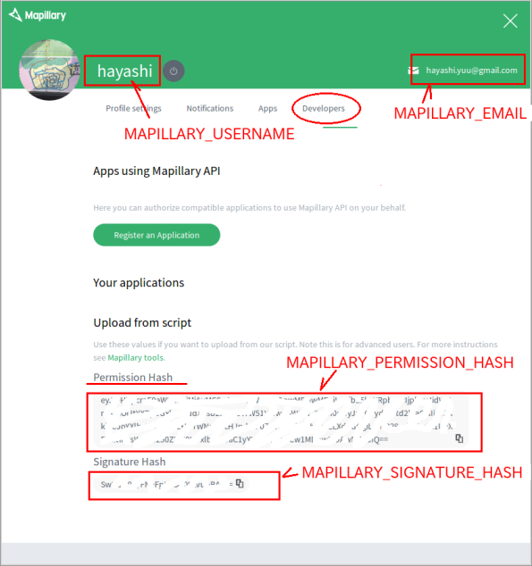

[タイムラプス動画ファイルから静止画を生成する](README.md)
----

# mapillary.sh のセットアップ

## dockerイメージの build

 * [mapillary_tools](https://github.com/mapillary/mapillary_tools)はすでにDockerイメージ **Movie2jpg** に含まれています。
 * [mapillary.sh] の設定とリビルドが必要です。

### 'Linux編'

1. テキストエディタを使って`~/Movie2jpg-master/mapillary.sh` ファイルを下記の内容に書き換えてください  
  ```
  export MAPILLARY_EMAIL="hoge@mail.com"
  export MAPILLARY_PASSWORD="password"
  export MAPILLARY_USERNAME="yourname"
  export MAPILLARY_PERMISSION_HASH="....=="
  export MAPILLARY_SIGNATURE_HASH="....="
  
  python /source/mapillary_tools/python/remove_duplicates.py /mnt/mapi/img/m/ /mnt/mapi/img/duplicate/
  python /source/mapillary_tools/python/upload_with_preprocessing.py /mnt/mapi/img/m/
  ```

[Mapillary](https://www.mapillary.com/app/settings/developers) へログインし、「Developer」のページを表示させ、そこに記載された項目を`mapillary.sh`に設定してください。

  

 * MAPILLARY_EMAIL　Mapilarry にログインする時に使っているメールアドレス
 * MAPILLARY_PASSWORD　パスワード
 * MAPILLARY_USERNAME   ユーザー名
 * MAPILLARY_PERMISSION_HASH
 * MAPILLARY_SIGNATURE_HASH

2. `Terminal` に下記コマンドを打ち込む(build)
  ```
  cd ~/Movie2jpg-master
  docker build -t movie2jpg .
  ```


----
[タイムラプス動画ファイルから静止画を生成する](README.md)
