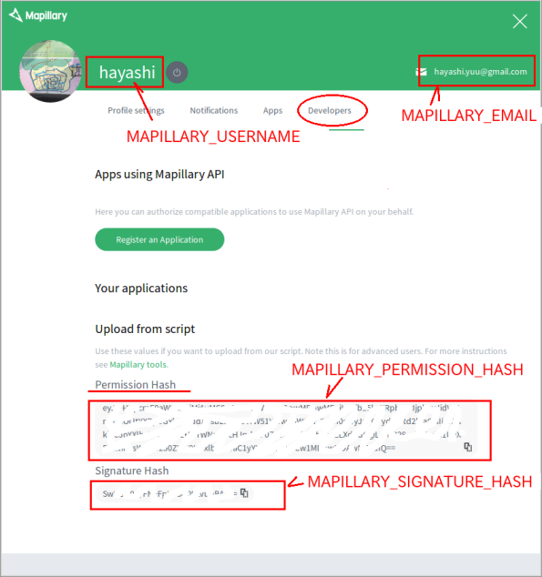

[タイムラプス動画ファイルから静止画を生成する](README.md)
----

# mapillary_tools のインストールとビルド

## Dockerのインストール

 * ここでは [Docker]()についての説明は省略します。各自ネットで調べてください。
 * **Docker**をインストールしてください。インストール手順はネットで調べてください。


## dockerイメージの build

 * [mapillary_tools](https://github.com/mapillary/mapillary_tools)

### 'Linux編'

1. [mapillary_tools-master.zip](https://github.com/mapillary/mapillary_tools/archive/master.zip) をダウンロードして解凍する  
フォルダ `mapillary_tools-master` が作成される

2. 作成されたフォルダ `mapillary_tools-master` をホームディレクトリ直下に移動する

3. テキストエディタを使って下記の内容の`~/mapillary_tools-master/mapillary.sh` ファイルを作成してください    
  ```
  export MAPILLARY_EMAIL="hoge@mail.com"
  export MAPILLARY_PASSWORD="password"
  export MAPILLARY_USERNAME="yourname"
  export MAPILLARY_PERMISSION_HASH="....=="
  export MAPILLARY_SIGNATURE_HASH="....="
  
  python /source/mapillary_tools/python/remove_duplicates.py /mnt/mapi/img/m/ /mnt/mapi/img/duplicate/
  python /source/mapillary_tools/python/upload_with_preprocessing.py /mnt/mapi/img/m/
  ```

[Mapillary](https://www.mapillary.com/app/settings/developers) へログインし、「Developer」のページを表示させ、そこに記載された項目を`mapillary.sh`に設定してください。

  

 * MAPILLARY_EMAIL　Mapilarry にログインする時に使っているメールアドレス
 * MAPILLARY_PASSWORD　パスワード
 * MAPILLARY_USERNAME   ユーザー名
 * MAPILLARY_PERMISSION_HASH
 * MAPILLARY_SIGNATURE_HASH

4. `~/mapillary_tools-master/Dockerfile` をテキストエディタで開いて、下記のように書き換えてください  
  ```
  FROM ubuntu:16.04
  
  # SETUP
  RUN \
    apt-get -qq update && \
    apt-get -yqq install \
        git \
        python-pip && \
    apt-get clean && \
    rm -rf /var/lib/apt/lists/*
  
  RUN \
    pip install --upgrade pip
  
  COPY . /source/mapillary_tools
  
  WORKDIR /source/mapillary_tools
  
  RUN pip install -r python/requirements.txt
  
  # append
  RUN mkdir /mnt/mapi
  COPY ./mapillary.sh /root
  ```

5. `Terminal` に下記コマンドを打ち込む(build)
  ```
  cd ~/mapillary_tools-master
  mkdir mapi
  mkdir mapi/img
  docker build -t mapillary_tools .
  ```
  小一時間かかります


----
[タイムラプス動画ファイルから静止画を生成する](README.md)
