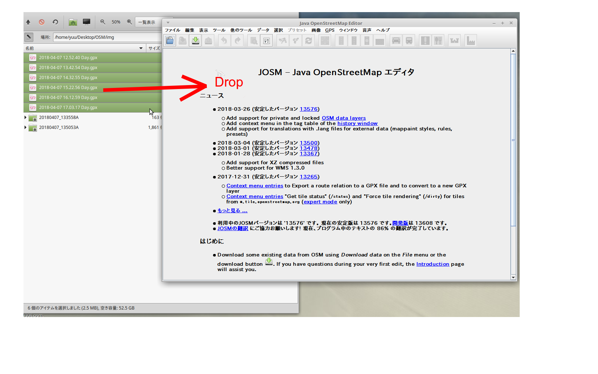
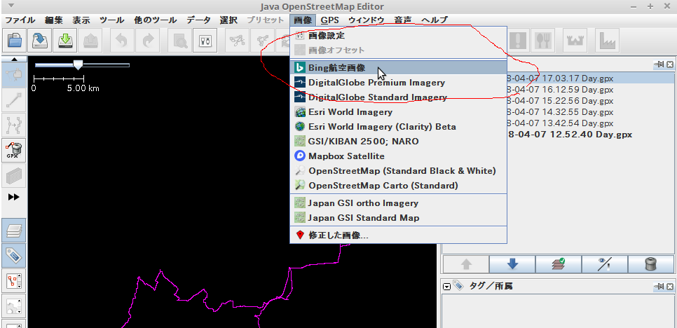
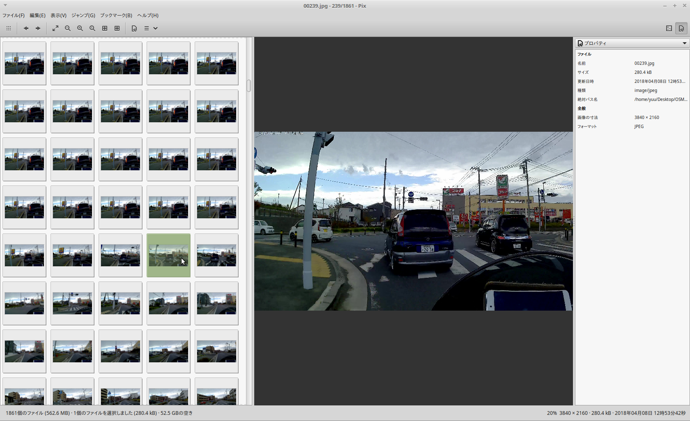
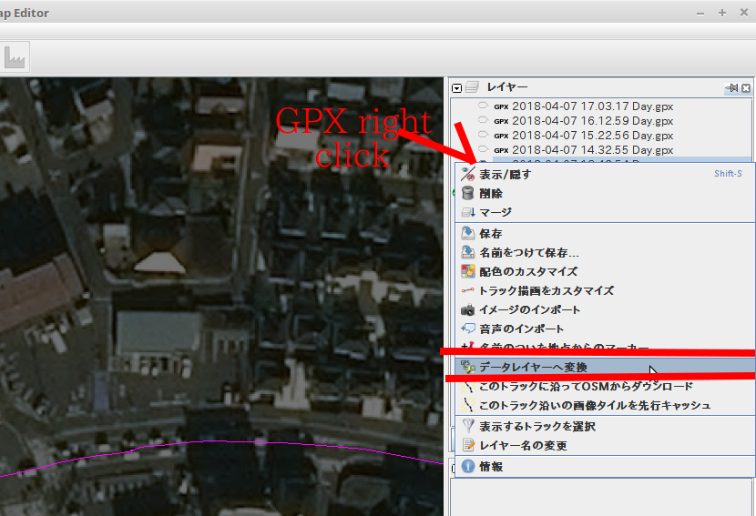
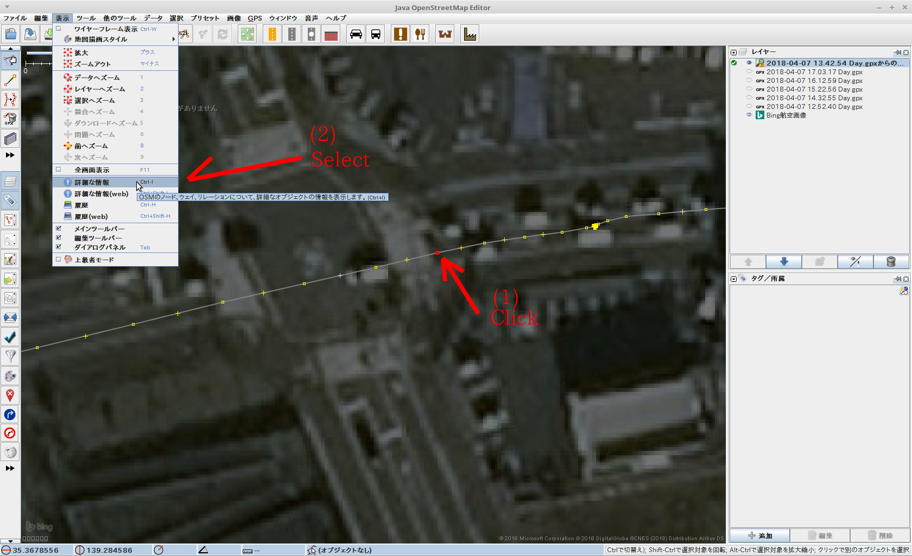
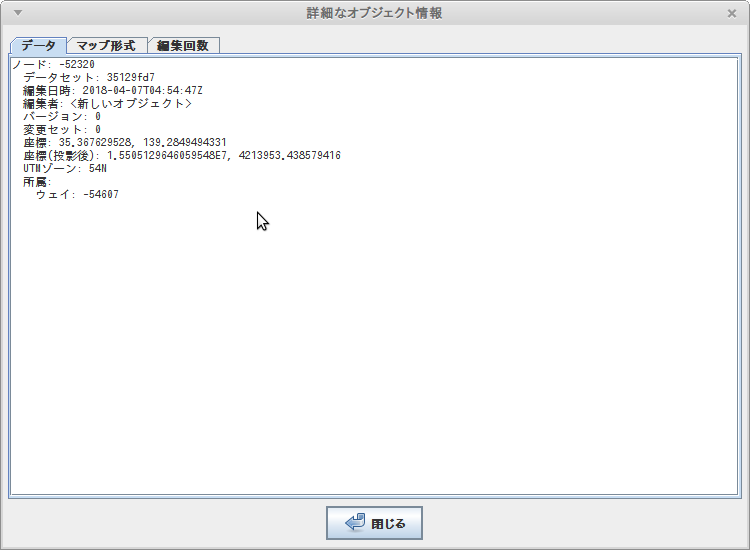

# タイムラプス動画ファイルから静止画を生成する

## （[撮影編](ACTIONCAM.md)）格安アクションカムで1.0秒間隔で撮影する方法

  撮影編はこちらを参照 → [中華アクションカムについて](ACTIONCAM.md)

## タイムラプスモード設定

 * 間隔は１秒  
    GPSロガーのロギング間隔を１秒間に設定するのでそれに合わせてタイムラプスも１秒間隔で十分。  
    最小0.5秒に設定することができるが、切り出したJPEGに撮影時刻を割り当てる際に１秒単位でしか設定することができないため、1秒間隔で十分。  


動画からMapillaryへアップロードするには、下記のステップ毎の処理が必要

 1. 動画ファイルから一定間隔の静止画(JPEG)ファイルを生成する

 1. 生成された静止画ファイルの更新日時を*撮影時刻*に書き換える

 1. JPEGファイルの*撮影時刻*と*GPSロガー*の時刻情報を突き合わせて JPEGのExif情報に*位置情報*を書き込む

 1. *Mapillary-tools*を使って Mapillary サイトにJPEGファイルを一括アップロードする。

これらの処理ごとに Java,Pyson,FFMPEG などのソフトウェアのインストールと設定が必要になります。
インストールと設定は、稼働させるOS毎に異なるため、説明が煩雑になるし、それぞれのOS毎の動作検証をすることもできません。
そこで、ここでは *Docker* イメージ'haya4/movie2jpg'を使って説明をします。


## Docker 'haya4/movie2jpg'

### Dockerのインストール

 * ここでは [Docker]()についての説明は省略します。各自ネットで調べてください。
 * **Docker**をインストールしてください。インストール手順はネットで調べてください。

### docker build

1. [Movie2jpg-master.zip](surveyor.mydns.jp/gitbucket/yuu/Movie2jpg/archive/master.zip) をダウンロードして解凍する  
フォルダ `Movie2jpg-master` が作成される

2. 作成されたフォルダ `Movie2jpg-master` をCドライブの直下に移動する

3. `Docker Quickstart Terminal` に下記コマンドを打ち込む(build)
  ```
  cd /c/Movie2jpg-master
  docker build -t haya4/movie2jpg .
  ```
  小一時間かかります

4. 

[Dockerfile](/gitbucket/yuu/Movie2jpg/blob/master/Dockerfile)

  ```
$ cd /home/yuu/workspace/Movie2jpg
$ docker build -t haya4/movie2jpg .
  ```

### 動画ファイルのセット

撮影した動画ファイルを所定の場所に配置します。

```
/home/yuu/Desktop
┃
┗━ ./OSM
　　　┃
　　　┣━ ./OSM/img
　　　┃
　　　┗━ ./OSM/Movie
　　　　　　┃
　　　　　　┣━ Movie2jpg.ini
　　　　　　┣━ XXXX.mp4
　　　　　　┗━ YYYY.mp4

```

 * フォルダ `/home/yuu/Desktop/OSM/Movie` に MP4ファイルを配置する。

 * フォルダ `/home/yuu/Desktop/OSM/Movie` に `Movie2jpg.ini` を配置する。

[Movie2jpg.ini](/gitbucket/yuu/Movie2jpg/blob/master/Movie2jpg.ini) の設定例
```
[FFMPEG]
FFMPEG_OUTPUT_FRAME_RATE=30
```
  - 1.0秒間隔で撮影した場合はFFMPEG_OUTPUT_FRAME_RATE=30 (fps=30) とすると1.0間隔の静止画が取り出せる


### Docker run

実行
```

$ docker run -it -v /home/yuu/Desktop/OSM:/mnt/osm haya4/movie2jpg java -cp .:/root/Movie2jpg.jar movie2jpg.Movie2jpg ./Movie/Movie2jpg.ini

```

実行すると、「Movie2jpg」が起動され、`/home/yuu/Desktop/OSM/Movie`フォルダ内の「mp4」ファイルごとに
`ffmpeg -ss 0 -i $(mp4 file) -f image2 -vf fps=$(FFMPEG_OUTPUT_FRAME_RATE) $(output file)`
が実行されます。

完了すると、`./OSM/img`フォルダの下にMP4ファイル名と同じ名前のフォルダが作成され、その中に切り出されたJPEG画像が生成されます。

```
/home/yuu/Desktop
┃
┗━ ./OSM
　　　┃
　　　┣━ ./OSM/img
　　　┃　　┣━ XXXX
　　　┃　　┃　　┣━ 00001.jpg
　　　┃　　┃　　┣━ 00002.jpg
　　　┃　　┃　　┣━     :
　　　┃　　┃　　┗━ 01861.jpg
　　　┃　　┃
　　　┃　　┗━ YYYY
　　　┃　　　　　┣━ 00001.jpg
　　　┃　　　　　┣━ 00002.jpg
　　　┃　　　　　┣━     :
　　　┃　　　　　┗━ 02408.jpg
　　　┃
　　　┗━ ./OSM/Movie
　　　　　　┃
　　　　　　┣━ XXXX.mp4
　　　　　　┗━ YYYY.mp4
```

-----

# 連番JPEGファイルに撮影時刻を割り付ける

### 用意するもの

 * 連番JPEGファイル 一定間隔で撮影されたもの（動画から切り出したもの）

 * GPSロガー（GPX)ファイル

1. [JOSM](https://josm.openstreetmap.de/)を起動する

2. 起動したJOSMにGPXファイルをドラッグ＆ドロップする(複数のGPXがあるときは全部まとめてドロップする)  
  

3. 背景画像を選択する（お好みで）  
  

4. ~img~フォルダの画像を画像ビューワなどで開き、サムネイルなどで画像が撮影された位置が特定できるファイルを見つける
 * トンネルの入り際
 * 橋の開始／終点
 * 交差点に侵入
  などが位置を特定しやすい。
  

  この例では、交差点の侵入（横断歩道のところ）

5. GPXの位置を特定します。GPXのままではわかりづらいのでGPXのところを *右クリック* して「データレイヤーへ変換」を選択  
  

6. GPXのノードが選択できるようになったので、イメージファイルの位置のノードを*クリック*して、メニュー「*表示*」-「*詳細な情報*」を選択する  
  

7. 表示された「詳細なオブジェクト情報」の「*編集日時*」を記録する  
  

8. 同様にしてもうひとつの位置がわかる画像を探して、そのGPX位置の「*編集日時*」を記録する

```
ノード: -53809
  データセット: 35129fd7
  編集日時: 2018-04-07T05:19:36Z
  編集者: <新しいオブジェクト>
  バージョン: 0
  変更セット: 0
  座標: 35.3778580483, 139.2325930484
  座標(投影後): 1.549930135997497E7, 4215349.844150893
  UTMゾーン: 54N
  所属: 
    ウェイ: -54607

イメージファイル: 01725.jpg
```

9. JPEGファイルの更新日付を書き換える

```
$ docker run -it -v /home/yuu/Desktop/OSM:/mnt/osm haya4/movie2jpg java -cp .:/root/Movie2jpg.jar:/root/commons-imaging-1.0-20170205.201009-115.jar osm.jp.gpx.Restamp ./img/20180407_135053A 00239.jpg 2018-04-07T05:54:47Z 01725.jpg 2018-04-07T05:19:36Z
```

----

# GPSログとJPEGの更新日付を付きあわせてJPEGのEXiFに位置情報を書き込む

### AdjustTime2を使う

----

# Mapillary-tools を使って*Mapillary*に大量アップ

```
/home/yuu/Desktop
┃
┗━ ./OSM
　　　┃
　　　┗━ ./OSM/img
　　　　　　┣━ ./OSM/img/m
　　　　　　┃　　┣━ 00001.jpg
　　　　　　┃　　┣━ 00002.jpg
　　　　　　┃　　┣━     :
　　　　　　┃　　┗━ 01861.jpg
　　　　　　┃
　　　　　　┗━ ./OSM/img/duplicate
```
 * ~/home/yuu/Desktop/OSM/img/m~フォルダにMapillaryにアップしたいJPEGファイルを置く

 * ~/home/yuu/Desktop/OSM/img/duplicate~フォルダに重複ファイルが置かれる


## Docker mapillary_tools

### Dockerfile

```
FROM ubuntu:16.04

# SETUP
RUN apt-get -qq update
RUN apt-get -y upgrade
RUN \
    apt-get -qq update && \
    apt-get -yqq install \
        git \
        python-pip && \
    apt-get clean && \
    rm -rf /var/lib/apt/lists/*

RUN \
    pip install --upgrade pip

RUN mkdir /mnt/osm

COPY . /source/mapillary_tools

WORKDIR /source/mapillary_tools

RUN pip install -r python/requirements.txt

RUN apt-get -qq update
RUN apt-get -yqq install openjdk-8-jre
```

### Docker build

~mapillary.sh~  
```
export MAPILLARY_EMAIL="hayashi.yuu@gmail.com"
export MAPILLARY_PASSWORD="yuu8844"
export MAPILLARY_USERNAME="hayashi"
export MAPILLARY_PERMISSION_HASH="eyJleHBpcmF0aW9uIjoiMjAyMC0wMS0wMVQwMDowMDowMFoiLCJjb25kaXRpb25zIjpbeyJidWNrZXQiOiJtYXBpbGxhcnkudXBsb2Fkcy5tYW51YWwuaW1hZ2VzIn0sWyJzdGFydHMtd2l0aCIsIiRrZXkiLCJoYXlhc2hpLyJdLHsiYWNsIjoicHJpdmF0ZSJ9LFsic3RhcnRzLXdpdGgiLCIkQ29udGVudC1UeXBlIiwiIl0sWyJjb250ZW50LWxlbmd0aC1yYW5nZSIsMCw1MDAwMDAwMF1dfQ=="
export MAPILLARY_SIGNATURE_HASH="SwRGN9K/FN+FpXPSO09LvuhBAGI="

# python /source/mapillary_tools/python/geotag_from_gpx.py /mnt/osm/img/m/ /mnt/osm/img/2016-04-09_150103.gpx

python /source/mapillary_tools/python/remove_duplicates.py /mnt/osm/img/m/ /mnt/osm/img/duplicate/

python /source/mapillary_tools/python/upload_with_preprocessing.py /mnt/osm/img/m/
```

```
cd /home/yuu/workspace/mapillary_tools
docker build -t haya4/movie2jpg .
```

### Docker run

```
cd /home/yuu/Desktop/workspace/Movie2jpg
docker run -it -v /home/yuu/Desktop/OSM:/mnt/osm haya4/movie2jpg /bin/bash /root/mapillary.sh

-v /home/yuu/Desktop/OSM:/mnt/osm
    PCのフォルダ(/home/yuu/Desktop/OSM)をコンテナのフォルダ(/mnt/osm)にマウントする

# cd /root
# sh ./mapillary.sh
#     :
#
```
