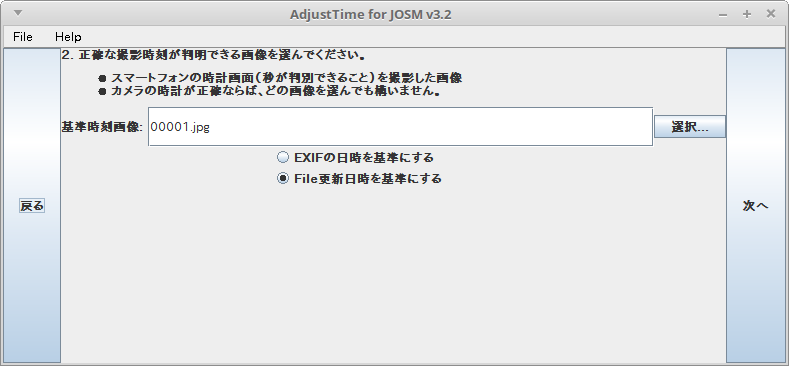
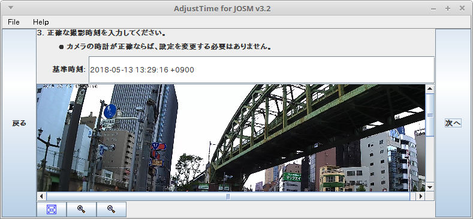
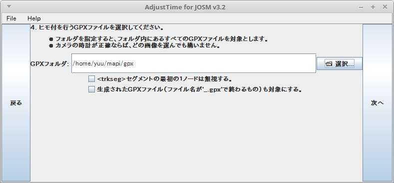
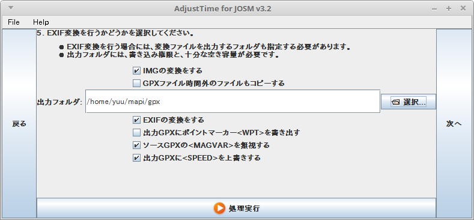
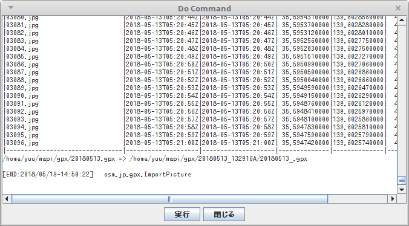
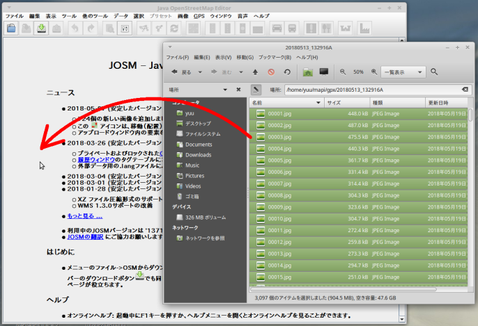

# タイムラプス動画ファイルからMapillary用の静止画を生成する
----

## （[撮影編](ACTIONCAM.md)）格安アクションカムでMapillary撮影する方法

  撮影編はこちらを参照 → [格安アクションカムについて](ACTIONCAM.md)

## 1. 撮影モードの設定

### 1.1 タイムラプスモード設定

 * 間隔は１秒  
    GPSロガーのロギング間隔を１秒間に設定するのでそれに合わせてタイムラプスも１秒間隔で撮影する。  
    最小0.5秒に設定することができるが、切り出したJPEGに撮影時刻を割り当てる際に１秒単位でしか設定することができないため、1秒間隔で十分。  


### 1.2 手順概要

動画からMapillaryへアップロードするには、下記のステップ毎の処理が必要

 1. タイムラプス動画を撮影する
 2. 動画ファイルから一定間隔の静止画(JPEG)ファイルを生成する
 3. 生成された静止画ファイルの更新日時を*撮影時刻*に書き換える
 4. JPEGファイルの*撮影時刻*と*GPSロガー*の時刻情報を突き合わせて JPEGのExif情報に*位置情報*を書き込む
 5. カメラとGPSロガーとのタイミング調整を行う
 6. 不要なイメージを削除する
 7. *Mapillary-tools*を使って Mapillary サイトにJPEGファイルを一括アップロードする。

これらの処理ごとに Java,Pyson,FFMPEG などのソフトウェアのインストールと設定が必要になります。
インストールと設定は、稼働させるOS毎に異なるため、説明が煩雑になるし、それぞれのOS毎の動作検証をすることもできません。
そこで、ここでは *Docker* イメージ'haya4/movie2jpg'を使って説明をします。


## 2. 動画ファイルから一定間隔の静止画(JPEG)ファイルを生成する


撮影された動画ファイルから１秒間隔の静止画を取り出します。

 * ソースとなる動画ファイルはタイムラプス撮影されたものに限定されるわけではありませんが、他の撮影方法で撮影された動画の動作確認は行っていませんので動くかどうかはわかりません。


### 2.1 Dockerのインストールとビルド

  **Docker 'haya4/movie2jpg'**

初回に限りDockerのインストールとビルドが必要です。

こちら → [DockerBuild](DOCKERBUILD.md) を参考にしてインストールとビルドを行ってください。


### 2.2 動画ファイルのセット

撮影した動画ファイルを所定の場所に配置します。

```
~/Movie2jpg-master
┃
┗━ ~/Movie2jpg-master/mapi
　　　┃
　　　┣━ ~/Movie2jpg-master/mapi/img
　　　┃
　　　┗━ ~/Movie2jpg-master/mapi/Movie
　　　　　　┃
　　　　　　┣━ Movie2jpg.ini
　　　　　　┣━ XXXX.mp4
　　　　　　┗━ YYYY.mp4
```
フォルダ `~/Movie2jpg-master/mapi/Movie` に 
 * **動画(MP4)**ファイルを配置する。
 * `Movie2jpg.ini` を配置する。

[Movie2jpg.ini](/gitbucket/yuu/Movie2jpg/blob/master/Movie2jpg.ini) の設定例  
```
[FFMPEG]
FFMPEG_OUTPUT_FRAME_RATE=30
```
  - 1.0秒間隔で撮影した場合はFFMPEG_OUTPUT_FRAME_RATE=30 (fps=30) とすると1.0間隔の静止画が取り出せる


### 2.3 静止画の切り出し処理を実行 - Docker run

**実行**:   
  ```
  cd ~/Movie2jpg-master
  docker run -it -v $(pwd)/mapi:/mnt/mapi:rw haya4/movie2jpg java -cp .:/root/Movie2jpg.jar:/root/commons-imaging-1.0-20170205.201009-115.jar movie2jpg.Movie2jpg ./Movie/Movie2jpg.ini
  ```

  実行すると、「Movie2jpg」が起動され、`~/Movie2jpg-master/mapi/Movie`フォルダ内の「動画(MP4)」ファイルごとに

  `ffmpeg -ss 0 -i $(mp4 file) -f image2 -vf fps=$(FFMPEG_OUTPUT_FRAME_RATE) $(output file)`

  が内部で実行されます。

  完了すると、`~/Movie2jpg-master/mapi/img`フォルダの下にMP4ファイル名と同じ名前のフォルダが作成され、その中に切り出されたJPEG画像が生成されます。

```
~/Movie2jpg-master
┃
┗━ ~/Movie2jpg-master/mapi
　　　┃
　　　┣━ ~/Movie2jpg-master/mapi/img
　　　┃　　┣━ XXXX
　　　┃　　┃　　┣━ 00001.jpg
　　　┃　　┃　　┣━ 00002.jpg
　　　┃　　┃　　┣━     :
　　　┃　　┃　　┗━ 01861.jpg
　　　┃　　┃
　　　┃　　┗━ YYYY
　　　┃　　　　　┣━ 00001.jpg
　　　┃　　　　　┣━ 00002.jpg
　　　┃　　　　　┣━     :
　　　┃　　　　　┗━ 02408.jpg
　　　┃
　　　┗━ ~/Movie2jpg-master/mapi/Movie
　　　　　　┃
　　　　　　┣━ XXXX.mp4
　　　　　　┗━ YYYY.mp4
```


-----

## 3. 連番JPEGファイルに撮影時刻を割り付ける

生成された連番JPEGファイルに撮影時刻を書き込む必要が有ります。

私の[自作](../LICENSE.txt)したソフトウェア **Restamp(Movie2jpg)** を使って連番JPEGの*ファイル更新日時*を撮影時刻に変換する方法を紹介します。


### 3.1 仕組み／原理

 * 一定間隔で撮影された連番ファイルの任意の２枚の撮影時刻を設定します。
 * ２枚の中間にあるファイルの数を数えて、各ファイルの撮影間隔を精確に算出します。
 * 算出された撮影間隔と２枚の撮影時刻を元に、他のすべての撮影時刻を算出し、JPEGファイルのファイル更新日時(updatetime)を撮影時刻に書き換えます。


  もし、カメラの時刻合わせに失敗していたり、時間ウォーターマークを設定し忘れた場合は、[撮影時刻推定方法](UPDATETIME.md) を参照してください。

時間ウォーターマークが設定されている場合は、下記の方法で抽出されたイメージファイルに撮影時刻を設定することができます。


### 3.2 時間ウォーターマークを使ったファイル更新日時の再設定

1. `img`フォルダの画像を画像ビューワなどで開き、画像のウォーターマークを読み取る(最初の方のファイルを選択する)

  

2. 同様にして、もうひとつの別の画像のウォーターマークを読み取る(最後の方のファイルを選択する)

3. コマンドラインを作る

コマンドライン：

(1) **冒頭**  
   「`docker run -it -v $(pwd)/mapi:/mnt/mapi:rw haya4/movie2jpg java -cp .:/root/Movie2jpg.jar:/root/commons-imaging-1.0-20170205.201009-115.jar osm.jp.gpx.Restamp `」  
  固定文字列

(2) **ディレクトリ**  
  連番ファイルが格納されたディレクトリ  
  例：「`./img/20180407_135053A `」

(3) **最初の方のファイル名** と **撮影日時**  
  `ファイル名` `撮影日時`  
  「撮影日時」は書式 `yyyy-MM-dd'T'HH:mm:ss'Z'` として９時間前の時刻を入力する(例: `2018-05-13T04:29:16`)  
  例：「`00239.jpg 2018-04-07T05:54:47Z `」

(4) **最後の方のファイル名** と **撮影日時**  
  `ファイル名` `撮影日時`  
  「撮影日時」は書式 `yyyy-MM-dd'T'HH:mm:ss'Z'` として９時間前の時刻を入力する(例: `2018-05-13T04:29:16`)  
  例：「`01725.jpg 2018-04-07T05:19:36Z `」

コマンドラインの例：
```
cd ~/Movie2jpg-master
docker run -it -v $(pwd)/mapi:/mnt/mapi:rw haya4/movie2jpg java -cp .:/root/Movie2jpg.jar:/root/commons-imaging-1.0-20170205.201009-115.jar osm.jp.gpx.Restamp ./img/20180407_135053A 00239.jpg 2018-04-07T05:54:47Z 01725.jpg 2018-04-07T05:19:36Z
```

ターミナルにコマンドラインを貼り付けて実行すると、JPEGファイルのファイル更新日時が「撮影日時」に書き換わります。


----

## 4. GPSログとJPEGの更新日付を付きあわせてJPEGのEXiFに位置情報を書き込む


**撮影日時**がファイルの更新日時に設定されると、GPXファイルとファイル更新日時を付きあわせてJPEGのEXIFに書き込む方法は無数に有ります。

使い慣れたツールを使って JPEGファイルのEXiF情報に位置情報を書き込んでください。


### 4.1 AdjustTime2を使う

ここでは 私の自作ツールを使ってEXiFに位置情報を書き込む方法を説明します。

1. **Java実行環境**をインストールしてください。インストール方法は割愛します。

2. [AdjustTime2](https://osdn.net/dl/importpicture/AdjustTime2_20180519.zip)をダウンロードする

3. ダウンロードした ZIPファイルをホームディレクトリ(`~/AdjustTime2`)に展開する

4. コマンドを叩いて 起動する  
  ```
  cd
  cd AdjustTime2
  chmod +x AdjustTime2.sh
  ./AdjustTime2.sh
  ```

5. *AdjustTime2* の画面が開いたら、「選択」ボタンを押して連番JPEGファイルが格納されているフォルダを**対象フォルダ**フィールドにセットする → 「次へ」  
  

6. 「選択」ボタンを押して任意のファイルを選択する → 「基準時刻画像」にファイルが選択される  
    
   → 「次へ」

7. そのまま「次へ」  
    

8. 既に撮影時刻が設定されているので、そのまま「次へ」  
    

9. *GPXフォルダ* に「`~/Movie2jpg-master/mapi/gpx`」をセットして、「次へ」  
    
  フォルダを設定した時は、そのフォルダ内のすべてのGPXファイルをひも付けの対象とします。  
  GPXファイルを指定した時は、指定されたGPXファイルのみひも付けの対象とします。

10. *書き出しフォルダ* に「`~/Movie2jpg-master/mapi/gpx`」をセット  
    
  「EXIFの変換をする」にチェックをつける

11. 「処理実行」ボタン  
    
  「実行」ホタン

12. 処理が終わったら「閉じる」ボタン  
  ```
  ~/Movie2jpg-master
  ┃
  ┗━ ~/Movie2jpg-master/mapi
  　　　┃
  　　　┗━ ~/Movie2jpg-master/mapi/gpx
  　　　　　　┃
  　　　　　　┗━ ~/Movie2jpg-master/mapi/gpx/XXX
  　　　　　　　　　┣━ 00001.jpg
  　　　　　　　　　┣━ 00002.jpg
  　　　　　　　　　┣━     :
  　　　　　　　　　┗━ 01861.jpg
  ```
  EXiFが付与されたファイルが `~/Movie2jpg-master/mapi/gpx` に作成されます。


----

## 6. カメラとGPSロガーとのタイミング調整を行う

カメラもGPSロガーも正確な時刻と同期させていれば 撮影時刻＝GPS位置 が一致するようにみえますが、実際には カメラとロガーとの相性の関係によって、組み合わせによっては２〜６秒ほどのズレが生じます。

次にこのズレの補正方法を示します。

1. **Java実行環境**をインストールしてください。インストール方法は割愛します。

2. **[JOSM](https://josm.openstreetmap.de/)**をインストールしてください。インストール方法は割愛します。

3. **[JOSM](https://josm.openstreetmap.de/)**を起動する

4. JOSMに「EXIFが作成されたフォルダ``/mapi/gpx/XXX`」内のすべてのファイルをドラッグ＆ドロップする  
  

5. JOSMの[メニュー]→[画像]→[お好みの背景画像]を選びます。この例では「Bing航空画像」を選んでいます  
  

6. ルート履歴から**交差点で曲がっている**箇所を探します。  
  
 
7. 交差点近傍の写真からGPSロガーとのズレを確認します。この例ではカメラ側の時間が５秒遅れています。  
  

8. *AdjustTime2* の撮影時刻設定画面に戻って、設定時間に「５秒」加えた値を設定して、再実行します  
  

9. 再度、JOSMを起動して「EXIFが作成されたフォルダ``/mapi/gpx/XXX`」内のすべてのファイルをドラッグ＆ドロップする  
  

10. 交差点近傍の写真の位置を再度確認します。  
    
  * 横断歩道のゼブラが足元にあることを確認できます。


----

## 8. 不要なイメージを削除する

Mapillary-toolsでも重複画像を削除する機能は有りますが、絶対にアップしたくないヤバイ画像や信号待ち等の画像は手動で削除してしまいましょう。

    
  * この例では高架下で信号待ちをしたせいでGPSの奇跡が大きくズレています。停止中の画像はすべて削除してしまいましょう。


----

## 9. 'Mapillary-tools'を使って*Mapillary*に一括大量アップロード


元ネタは[ここ](https://qiita.com/kudarisenmon/items/3c4906bfeed2010e600d)から引用しています
 * [mapillary_tools を使ってアクションカムで撮った写真をMapillaryに投稿する](https://qiita.com/kudarisenmon/items/3c4906bfeed2010e600d)

ここでは Docker を使った方法を紹介します。

### 9.1 'mapillary_tools'のインストールとビルド

  **Docker 'mapillary_tools'**

'mapillary_tools'は Dockerイメージ 'haya4/Movie2jpg' に含まれています。
初回に限り[mapillary.sh](/gitbucket/yuu/Movie2jpg/blob/master/mapillary.sh)のセットアップが必要です。

こちら → [MAPILLARY_SETUP](MAPILLARY_SETUP.md) を参考にしてインストールとビルドを行ってください。

### 9.2 'mapillary_tools'の設定。。

```
~/Movie2jpg-master
┃
┗━ ~/Movie2jpg-master/mapi
　　　┃
　　　┗━ ~/Movie2jpg-master/mapi/img
　　　　　　┃
　　　　　　┣━ ~/Movie2jpg-master/mapi/img/m
　　　　　　┃　　┣━ 00001.jpg
　　　　　　┃　　┣━ 00002.jpg
　　　　　　┃　　┣━     :
　　　　　　┃　　┗━ 01861.jpg
　　　　　　┃
　　　　　　┗━ ~/Movie2jpg-master/mapi/img/duplicate
```
 * 「~/Movie2jpg-master/mapi/img/m」フォルダにMapillaryにアップしたいJPEGファイルを置く  
  (「~/Movie2jpg-master/mapi/gpx」に作成されたEXiFが付与されたファイルが入ったフォルダを「~/Movie2jpg-master/mapi/img/m」フォルダに変更する)

 * 「~/Movie2jpg-master/mapi/img/duplicate」フォルダに重複ファイルが置かれる


### 9.3 Docker 'mapillary_tools'の実行

```
cd ~/Movie2jpg-master
docker run -it -v $(pwd)/mapi:/mnt/mapi:rw haya4/movie2jpg /bin/bash /root/mapillary.sh
docker run -it -v $(pwd)/mapi:/mnt/mapi:rw haya4/movie2jpg chmod 777 -R /mnt/mapi
```

  ```
  -v $(pwd)/mapi:/mnt/mapi:rw
    PCのフォルダ(~/mapi)をコンテナのフォルダ(/mnt/mapi)にマウントする
  
  # cd /root
  # sh ./mapillary.sh
  #     :
  #
  ```


