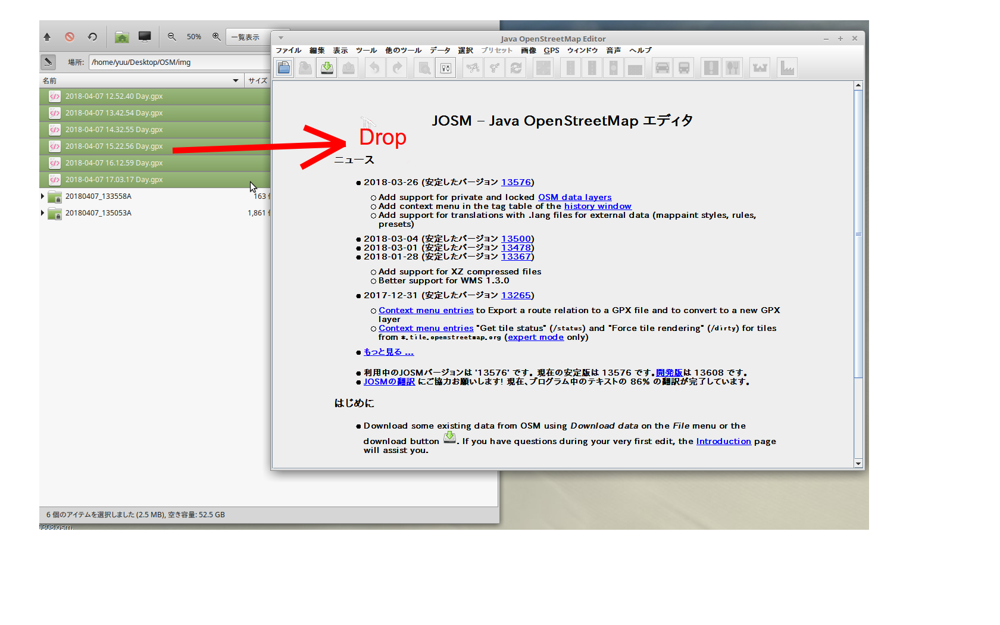

[タイムラプス動画ファイルから静止画を生成する](README.md)
----

# (撮影日時なし編)連番JPEGファイルに撮影時刻を割り付ける

### 用意するもの

 * 連番JPEGファイル 一定間隔で撮影されたもの（動画から切り出したもの）

 * GPSロガー（GPX)ファイル

1. [JOSM](https://josm.openstreetmap.de/)を起動する

2. 起動したJOSMにGPXファイルをドラッグ＆ドロップする(複数のGPXがあるときは全部まとめてドロップする)  
  

3. 背景画像を選択する（お好みで）  
  

4. ~img~フォルダの画像を画像ビューワなどで開き、サムネイルなどで画像が撮影された位置が特定できるファイルを見つける
 * トンネルの入り際
 * 橋の開始／終点
 * 交差点に侵入
  などが位置を特定しやすい。
  

  この例では、交差点の侵入（横断歩道のところ）

5. GPXの位置を特定します。GPXのままではわかりづらいのでGPXのところを *右クリック* して「データレイヤーへ変換」を選択  
  

6. GPXのノードが選択できるようになったので、イメージファイルの位置のノードを*クリック*して、メニュー「*表示*」-「*詳細な情報*」を選択する  
  

7. 表示された「詳細なオブジェクト情報」の「*編集日時*」を記録する  
  

8. 同様にしてもうひとつの位置がわかる画像を探して、そのGPX位置の「*編集日時*」を記録する

```
ノード: -53809
  データセット: 35129fd7
  編集日時: 2018-04-07T05:19:36Z
  編集者: <新しいオブジェクト>
  バージョン: 0
  変更セット: 0
  座標: 35.3778580483, 139.2325930484
  座標(投影後): 1.549930135997497E7, 4215349.844150893
  UTMゾーン: 54N
  所属: 
    ウェイ: -54607

イメージファイル: 01725.jpg
```

9. JPEGファイルの更新日付を書き換える

```
$ docker run -it -v $(pwd)/mapi:/mnt/mapi haya4/movie2jpg java -cp .:/root/Movie2jpg.jar:/root/commons-imaging-1.0-20170205.201009-115.jar osm.jp.gpx.Restamp ./img/20180407_135053A 00239.jpg 2018-04-07T05:54:47Z 01725.jpg 2018-04-07T05:19:36Z
```
